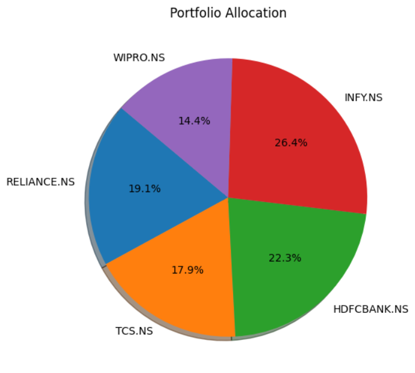
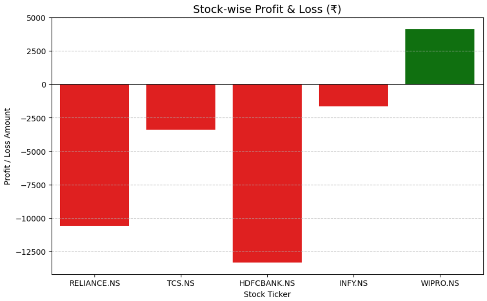

# 📉 Live Stock Portfolio Tracker 📊

This project is a real-time portfolio analysis tool built to track stock market performance using Python. As a career-switcher from **Finance to Data Science**, I developed this to automate investment tracking and visualize portfolio health.

## ✨ Key Features
* **Live Data:**  Real-time stock prices fetched using `yfinance` API.
* **Data Cleaning:** Robust logic to handle missing data or delisted stocks.
* **Calculations:** Automated tracking of Total Investment, Current Value, and P/L (Profit/Loss).
* **Visualizations:** Clean charts for allocation and performance analysis.

## 🛠️ Tools Used
* **Python** (Pandas, yfinance)
* **Visualization:** Matplotlib, Seaborn

## 📊 Visualizations

### 1. Portfolio Allocation
Shows how your money is distributed across different stocks.

### 2. Profit & Loss Analysis
Visual representation of which stocks are in profit or loss.

## 🚀 Why this project?
Coming from a Finance background, I wanted to bridge the gap between financial market knowledge and data-driven automation. This project showcases my ability to handle APIs, clean data, and present insights visually.

---
Created by **Payal Das**
